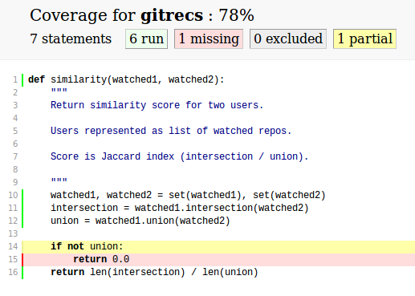

:title: Getting started testing
:author: Carl Meyer
:description: a presentation on getting started testing, for PyCon US 2013
:keywords: presentation, python, testing, pycon

:skip-help: true
:data-transition-duration: 400


----

:id: title

Getting started testing
=======================

|hcard|

.. note::

   Thanks for invite (thank Matt, Dave, WebFilings)

   PyCon talk - tell me what sucks! Especially tell me what I should cut out!
   All feedback welcome, even "it was boring, add more pictures of cats."

   How many have written tests? How many measure test coverage? How many
   maintain 100% coverage?

   (Beginner-level talk, may be review for some, hopefully some new things.)

----

:id: thistalk
:data-reveal: 1

This talk
---------

* Why test?

* How to test?

* When to test?

* How much to test?

* What if...?

|lightbulb|

.. |lightbulb| raw:: html

   

.. note::

   So here's the plan for the next half hour:

   * We'll discuss (briefly!) why to write tests.

   * We'll talk about how to write tests in Python, with lots of code examples
     and tool recommendations.

   * We'll talk about when to write your tests,

   * ...which tests and how many tests to write.

   * And we'll talk about some common what-if scenarios, like adding tests to a
     large untested codebase.

   Hopefully by the end the testing lightbulb will turn on (if it hasn't
   already), and you'll be so hooked you won't even be able to sleep tonight
   until you've written a bunch of tests.


----

:data-reveal: 1

Me
----

* Writing Python since 2002.

* Professionally since 2007.

* Writing a lot of tests since 2009.

* Mostly web development.

* OSS: pip, virtualenv, Django

.. note::

   A very brief story about me, Python, and testing...

   I like to write tests. Even this slide deck has tests!

   I mostly do web development, but I've tried to keep this talk general.

   I didn't create these things, but I've done a lot of work on them.

----

.. image:: images/logo.svg
   :width: 800px

.. note::

   I work at OddBird, we build beautiful web apps, you can hire us!

----

Let's make a thing!
-------------------

.. note::

   A GitHub recommendation engine!

   Find the projects you ought to know about...

   It's been done already. Oh well.

----

gitrecs.py
----------

.. code:: python

   def similarity(watched1, watched2):
       """
       Return similarity score for two users.

       Users represented as list of watched repos.

       Score is Jaccard index (intersection / union).

       """
       intersection = 0
       for repo in watched1:
           if repo in watched2:
               intersection += 1
       union = len(watched1) + len(watched2) - intersection

       return intersection / union

.. note::

   Similarity score, 0 to 1.

   Jaccard index: intersection over union.

   Now of course we want to make sure it works!

----

It works!
---------

.. code:: python

   >>> similarity(['a', 'b'], ['b', 'c', 'd'])
   0.25

   >>> similarity(['a', 'b', 'c'], ['b', 'c', 'd'])
   0.5

   >>> similarity(['a', 'b', 'c'], ['d'])
   0.0

.. note::

   So far, so good!

   But here's a bug...

----

Uh oh
-----

.. code:: python

   >>> similarity(['a', 'a', 'b'], ['b'])
   0.3333333333333333

.. note::

   Jaccard index is a set metric, and our naive implementation with lists
   doesn't handle duplicates correctly. Should be 1/2, got 1/3.

   Fortunately, Python's got an excellent built-in set data structure, so let's
   rewrite to use that instead and fix this bug!

----

Now with more set
-----------------

.. code:: python

   def similarity(watched1, watched2):
       """
       Return similarity score for two users.

       Users represented as list of watched repos.

       Score is Jaccard index (intersection / union).

       """
       watched1, watched2 = set(watched1), set(watched2)
       intersection = watched1.intersection(watched2)
       union = watched1.union(watched2)

       return len(intersection) / len(union)

----

Fixed!
------

.. code:: python

   >>> similarity(['a', 'a', 'b'], ['b'])
   0.5

.. note::

   Great, works!

   But we totally rewrote it, better make sure we didn't break anything...

----

Did we break anything?
----------------------

.. code:: python

   >>> similarity({'a', 'b'}, {'b', 'c', 'd'})
   0.25

   >>> similarity({'a', 'b', 'c'}, {'b', 'c', 'd'})
   0.5

   >>> similarity({'a', 'b', 'c'}, {'d'})
   0.0

.. note::

   All good!

----

:data-reveal: 1

This gets old.
--------------

* Repetitive and boring.

* Not easily reproducible.

* Error-prone.

.. note::

   * What happens with boring tasks? I skip them! Now I'll ship broken code!

   * If it breaks for you, hard to tell another developer how to see the
     breakage.

   * Did I calculate all those results right? Will I do it right next time?

----

:data-reveal: 1

We're software developers!
--------------------------

* Automating boring things is what we do.

.. note::

   We know how to handle boring repetitive tasks, we write software to automate
   them!

----

.. invisible-code-block: python

   import io, sys, types
   sys.modules['gitrecs'] = types.ModuleType('gitrecs')
   sys.modules['gitrecs'].similarity = similarity


test_gitrecs.py
---------------

.. code:: python

   from gitrecs import similarity

   assert similarity({'a', 'b'}, {'b', 'c', 'd'}) == 0.25
   assert similarity(['a', 'a'], ['a', 'b']) == 0.5

.. note::

   Better! Easily repeatable tests.

   Hmm, another bug.

----

A bug!
------

.. ignore-next-block
.. code:: python

   from gitrecs import similarity

   assert similarity({}, {}) == 0.0
   assert similarity({'a', 'b'}, {'b', 'c', 'd'}) == 0.25
   assert similarity(['a', 'a'], ['a', 'b']) == 0.5

::

    Traceback (most recent call last):
      File "test_gitrecs.py", line 3, in <module>
        assert similarity({}, {}) == 0.0
      File "/home/carljm/gitrecs.py", line 14, in similarity
        return len(intersection) / len(union)
    ZeroDivisionError: division by zero

.. note::

   We can fix the bug, but we have a problem with our tests: because the first
   one failed, none of the others ran.

   It'd be better if every test ran every time, pass or fail, so we could get a
   more complete picture of what's broken and what isn't.

----

.. code:: python

   def test_empty():
       assert similarity({}, {}) == 0.0

   def test_sets():
       assert similarity({'a', 'b'}, {'b', 'c', 'd'}) == 0.25

   def test_list_with_dupes():
       assert similarity(['a', 'a'], ['a', 'b']) == 0.5

   if __name__ == '__main__':
       for func in test_empty, test_quarter, test_half:
           try:
               func()
           except Exception as e:
               print("{} FAILED: {}".format(func.__name__, e))
           else:
               print("{} passed.".format(func.__name__))

.. note::

   Some code to run each test, catch any exceptions, and report whether the
   test passed or failed.

   Fortunately, we don't have to do this ourselves; there are test runners to
   do this for us!

::

   test_empty FAILED: division by zero
   test_quarter passed.
   test_half passed.


----

pip install pytest
------------------

.. code:: python

   from gitrecs import similarity

   def test_empty():
       assert similarity({}, {}) == 0.0

   def test_sets():
       assert similarity({'a', 'b'}, {'b', 'c', 'd'}) == 0.25

   def test_list_with_dupes():
       assert similarity(['a', 'a'], ['a', 'b']) == 0.5

.. note::

   One of these runners is pytest; we can install it and cut our test file down
   to just the tests themselves, no test-running boilerplate at all.

----

::

   $ py.test
   =================== test session starts ===================
   platform linux -- Python 3.3.0 -- pytest-2.3.4
   collected 3 items

   test_gitrecs.py F..

   ======================== FAILURES =========================
   _______________________ test_empty ________________________

       def test_empty():
   >       assert similarity({}, {}) == 0.0

   test_gitrecs.py:4:
   _ _ _ _ _ _ _ _ _ _ _ _ _ _ _ _ _ _ _ _ _ _ _ _ _ _ _ _ _ _

       def similarity(watched1, watched2):
           intersection = watched1.intersection(watched2)
           union = watched1.union(watched2)
   >       return len(intersection) / len(union)
   E       ZeroDivisionError: division by zero

   gitrecs.py:14: ZeroDivisionError
   =========== 1 failed, 2 passed in 0.02 seconds ============

.. note::

   Run py.test - it automatically finds our tests (because they are in a file
   whose name begins with "test", and each test function's name begins with
   "test") and runs them, with isolation so that even if one fails, they all run.

   It shows us the test file it found, shows a dot for each passed test and an
   F for each failed one.

   And we get some nice helpful debugging output around the failure too.

----

Just for kicks:
---------------

.. ignore-next-block
.. code:: python

   import pytest

   from gitrecs import similarity

   @pytest.mark.parametrize('data', [
       (({}, {}), 0.0),
       (({'a', 'b'}, {'b', 'c', 'd'}), 0.25),
       ((['a', 'a'], ['a', 'b']), 0.5)
       ])
   def test_similarity(data):
       args, expected = data
       assert similarity(*args) == expected

.. note::

   For repetitive tests like these that just call the same function on various
   data and assert on the output, py.test gives us a way to clean up that
   repetition: parameterized tests. It runs the test once with each parameter
   set, and they are treated as separate tests, each one can pass or fail
   individually.

----

Now let's fix that bug.
-----------------------

.. code:: python

   def similarity(watched1, watched2):
       """
       Return similarity score for two users.

       Users represented as list of watched repos.

       Score is Jaccard index (intersection / union).

       """
       watched1, watched2 = set(watched1), set(watched2)
       intersection = watched1.intersection(watched2)
       union = watched1.union(watched2)

       if not union:
           return 0.0
       return len(intersection) / len(union)

----

Tests pass! Ship it!
--------------------

::

   $ py.test
   =================== test session starts ===================
   platform linux -- Python 3.3.0 -- pytest-2.3.4
   collected 3 items

   test_gitrecs.py ...

   ================ 3 passed in 0.02 seconds =================

.. note::

   Not only can we ship this code with some confidence that it works now, but
   also some confidence that if we change the implementation in the future and
   reintroduce any of these bugs, we'll catch it as soon as we run the tests.

----

:data-reveal: 1

Test runners
------------

A brief synopsis and digression

* We saw `py.test`_ in action: ``pip install pytest; py.test``

  .. _py.test: http://pytest.org

* `Nose`_ is similar: ``pip install nose; nosetests``

  .. _Nose: https://nose.readthedocs.org/

* Both can run simple function tests with asserts.

* `unittest`_ is in the standard library, similar to "xUnit" test frameworks in
  various languages. Tests require a bit more boilerplate. ``python -m unittest
  discover``

  .. _unittest: http://docs.python.org/3.3/library/unittest.html

* Others: `twisted.trial`_, `zope.testrunner`_

  .. _twisted.trial: http://twistedmatrix.com/trac/wiki/TwistedTrial
  .. _zope.testrunner: https://pypi.python.org/pypi/zope.testrunner

.. note::

   Don't waste too much time worrying about this, you'll do just fine with any
   of them. Better to pick one and dive in and start writing tests! I like
   py.test, use what you like.

----

A unittest test
---------------

.. code:: python

   from unittest import TestCase
   from gitrecs import similarity

   class TestSimilarity(TestCase):
       def test_empty(self):
           score = similarity({}, {})
           self.assertEqual(score, 0.0)

       def test_half(self):
           score = similarity({'a'}, {'a', 'b'})
           self.assertEqual(score, 0.5)

.. note::

   Note the use of methods on self (assertEqual and friends) rather than simple
   asserts.

----

:data-reveal: 1

Why write tests?
----------------

#. Tests tell you when your code is broken.

#. Tests improve the design of your code.

.. note::

   #. ... as we just saw. "More fun to write tests on weekdays than fix bugs on
      weekends." This is the primary reason most people write tests, and it's a
      plenty good one.

   #. ...if you listen to them. How? Let's look at an example.

----

The first draft
~~~~~~~~~~~~~~~

.. code:: python

   class GithubUser:
       def get_watched_repos(self):
           """Return this user's set of watched repos."""
           # ... GitHub API querying happens here ...

   def similarity(user1, user2):
       """Return similarity score for given users."""
       watched1 = user1.get_watched_repos()
       watched2 = user2.get_watched_repos()

       # ... same Jaccard index code ...

.. note::

   You may have been thinking, of course tests are easy to write when you're
   testing nice simple functions like that similarity function.

   Here's a secret: that wasn't the first version of similarity that I
   wrote. The first version looked more like this.

   Imagine writing tests for this similarity function.

----

Harder to test
--------------

.. code:: python

   class FakeGithubUser:
       def __init__(self, watched):
           self.watched = watched

       def get_watched_repos(self):
           return watched

   def test_similarity():
       assert similarity(
           FakeGithubUser({'a'}),
           FakeGithubUser({'a', 'b'})
           ) == 0.5

.. note::

   We take advantage of duck-typing and create a fake replacement for
   GithubUser that doesn't go out and query the GitHub API, it just returns
   whatever we tell it to.

   This is a fine testing technique when testing code that has a collaborator
   that is critical for its purpose. But when you have to do this, it should
   cause you to ask yourself if it's essential to what you want to test, or if
   the design of your code is making testing harder than it should be.

   In this case, the collaborator is an avoidable distraction. What we really
   want to test is the similarity calculation; GithubUser is an irrelevant
   distraction. We can extract a similarity function that operates just on sets
   of repos so it doesn't need to know anything about the GithubUser class, and
   then our tests become much simpler.

----

:data-reveal: 1

Testable is maintainable
------------------------

* Code maintenance == managing change.

* The less a function knows about the world, the more robust it is against
  changes in the world ("principle of least knowledge").

* The less a function knows about the world, the less of the world you
  have to set up in order to test it.

.. note::

   Function (or class, or module - whatever the system under test)

   In this case, similarity is harder to test if it knows about GithubUser,
   because we have to set up a GithubUser (or a fake one) to feed to it for
   every test. And it's also more fragile, because if the name of the
   get_watched_repos method changes, it will break.

   It knows more than it needs to know to do its job! By narrowing its vision
   of the world, we make it both easier to test and easier to maintain.

----

If you can't ditch it, mock
~~~~~~~~~~~~~~~~~~~~~~~~~~~

.. code:: python

   from urllib.request import urlopen
   import json

   API_BASE = 'https://api.github.com'

   class GithubUser:
       def __init__(self, username):
           self.username = username

       def get_watched_repos(self):
           url = API_BASE + '/users/{}/subscriptions'.format(
               self.username)
           response = urlopen(url)
           data = json.loads(response.read().decode('utf-8'))
           return {r['full_name'] for r in data}

``urlopen`` is key; can't push it up to another layer.

.. note::

   Consider testing the "get_watched_repos" method.

   It has a collaborator; the "urlopen" function. This collaborator is
   essential to what it does, we can't push it up to another layer.

   But we don't want our tests hitting the GitHub API every time we run them:
   that's not considerate, and makes our tests fragile to network issues or
   changes in the data at GitHub, which we can't control.

----

:data-reveal: 1

Replacing a collaborator
------------------------

* Could add an argument ("dependency injection").

* Or we can monkeypatch!

.. note::

   * But this argument would only be used in tests, so it's unfortunate to add
     that complexity to the production code. In a static language this might be
     our only choice (and some languages have entire frameworks for it!), but
     in Python we have simpler options.

   * Python module namespaces are malleable at runtime, so we can temporarily
     make a name refer to something else for the duration of a test.

----

.. code:: python

   import json
   import gitrecs

   class FakeResponse:
       def __init__(self, content):
           self.content = content

       def read(self):
           return self.content

   def test_get_watched_repos():
       data = json.dumps(
           [{'full_name': 'a/repo'}, {'full_name': 'b/repo'},
            ]).encode('utf-8')
       fake_urlopen = lambda url: FakeResponse(data)
       _real_urlopen = gitrecs.urlopen
       gitrecs.urlopen = fake_urlopen
       try:
           user = gitrecs.GithubUser('carljm')
           watched = user.get_watched_repos()
       finally:
           gitrecs.urlopen = _real_urlopen
       assert watched == {'a/repo', 'b/repo'}

.. note::

   (Explain what this code is doing; note necessity of finally clause.)

   But this test is ugly and complicated. There's a lot of accidental
   complexity obscuring the essence of the test.

   Fortunately, once again there are tools to do this work for us.

----

With unittest.mock
------------------

.. code:: python

   from unittest import mock
   import json
   import gitrecs

   class FakeResponse:
       def __init__(self, content):
           self.content = content

       def read(self):
           return self.content

   @mock.patch('gitrecs.urlopen')
   def test_get_watched_repos(urlopen):
       data = json.dumps(
           [{'full_name': 'a/repo'}, {'full_name': 'b/repo'},
            ]).encode('utf-8')
       urlopen.return_value = FakeResponse(data)
       user = gitrecs.GithubUser('carljm')
       watched = user.get_watched_repos()
       assert watched == {'a/repo', 'b/repo'}

.. note::

   (Python 2: ``pip install mock`` and ``import mock``.)

   Now mock takes care of the dirty work of replacing ``gitrecs.urlopen`` and
   making sure it gets replaced back at the end of the test, making our test
   shorter and clearer.

   But I'm still not satisfied with it! Essence: if GitHub returns this list of
   dicts, we transform it into a set of repo full_names. Essence obscured here
   by all this accidental complexity: the FakeResponse with a read() method,
   needing to encode stuff to bytes because that's what a urlopen response
   contains, needing to dump a data structure to JSON...

   And if we need to write multiple tests for the data-structure handling,
   every single test will be cluttered with this additional cruft.

----

Separating concerns
-------------------

.. code:: python

   from urllib.request import urlopen
   import json

   API_BASE = 'https://api.github.com'

   def call_api(path):
       url = API_BASE + path
       response = urlopen(url)
       return json.loads(response.read().decode('utf-8'))

   class GithubUser:
       def __init__(self, username):
           self.username = username

       def get_watched_repos(self):
           data = call_api(
               '/users/{}/subscriptions'.format(self.username))
           return {r['full_name'] for r in data}

.. note::

   Now we split out the details of calling GitHub's API and returning the
   parsed JSON data, so our get_watched_repos method doesn't need to concern
   itself with the details of how that data is fetched, decoded, and parsed.

   This refactored code still passes the test we wrote, so we can trust that
   it's correct! But now it allows us to write much simpler tests for
   get_watched_repos.

----

.. code:: python

   from unittest import mock
   import gitrecs

   @mock.patch('gitrecs.call_api')
   def test_get_watched_repos(call_api):
       data = [{'full_name': 'a/r'}, {'full_name': 'b/r'}]
       call_api.return_value = data

       user = gitrecs.GithubUser('carljm')
       watched = user.get_watched_repos()

       assert watched == {'a/r', 'b/r'}
       call_api.assert_called_with(
           '/users/carljm/subscriptions')

.. note::

   Ahh, much better. This test now clearly communicates its purpose, without
   distractions.

   We also use a feature of mock to assert that get_watched_repos calls
   call_api with the correct arguments.

----

.. code:: python

   from unittest import mock
   import json
   import gitrecs

   class FakeResponse:
       def __init__(self, content):
           self.content = content

       def read(self):
           return self.content

   @mock.patch('gitrecs.urlopen')
   def test_call_api(urlopen):
       data = {'some': 'data'}
       content = json.dumps(data).encode('utf-8')
       urlopen.return_value = FakeResponse(content)

       returned = gitrecs.call_api('/some/path')

       assert returned == data
       urlopen.assert_called_with(
           'https://api.github.com/some/path')

.. note::

   For completeness, here's what the test for ``call_api`` would look
   like. Note that this test no longer does anything with the actual data
   returned from the API call, so we really only need this one test with all
   the FakeResponse stuff; we may need many tests for different API calls, and
   they can all omit that complexity.

   We have lost something with this change, though - if the signature of
   ``call_api`` changes, we could change this test and our tests would still
   pass, even though ``get_watched_repos`` is now calling it with the wrong
   arguments. We are now testing both ``call_api`` and ``get_watched_repos`` in
   isolation; we are not testing that their integration - that they work
   together correctly.

----

:data-reveal: 1

Unit tests
----------

* Test one "unit" of code (function or method).

* Isolated from complexities of collaborators.

* Small & fast!

Integration tests
-----------------

* Test that components talk to each other correctly.

* Slower.


.. note::

   Unit.

   * These are the tests we've been looking at.

   * Unless collaborators are simple, replace with fakes.

   * Don't exercise very much code.

   Integration.

   * Can be at various levels: testing integration of two different
     methods/classes, up to end-to-end tests of the entire system (these are
     sometimes called acceptance tests).

   * Exercise more code; may also exercise external systems (e.g. database) and
     require more setup.

----

:data-reveal: 1

Use unit tests for
------------------

* Checking correctness of algorithms, data structures.

* Testing edge cases and error cases, covering all sides of conditionals.

* You can write lots, they're small & fast!


Use integration tests for
-------------------------

* Checking integration of components.

* Checking integration with external systems.

* In a web app, often HTTP request/response tests.

* Don't write one when a unit test would suffice.

.. note::

   E.g. if your similarity function breaks with two empty sets, like we saw at
   the beginning of the talk, write a unit test for your similarity function,
   not an integration test that sets up two fake github users watching no repos
   and runs through everything.

----

:data-reveal: 1

A feature-adding workflow
-------------------------

* Write an integration test describing the working feature.

* Start implementation from the outside in.

* Programming by wish. "I wish I had a function that..." and stub it.

* For each stubbed function, write unit tests describing how it should actually
  work and complete the implementation to make those tests pass.

* Spikes: when you need to just write a bunch of exploratory code to figure out
  the problem.

.. note::

   The question always arises: write your tests first or last? You'll get
   benefit from your tests either way, so do whatever works. I like writing
   tests first.

   Spikes: the test-driven development religion says when you're done with a
   spike, you delete it and rewrite with test-first development, using the
   knowledge you gained from the spike. TBH, I don't usually do this, I just
   add tests and refactor the spiked code as I go to make it more testable.

----

:data-reveal: 1

A bug-fixing workflow
---------------------

* Write a test that fails because of the bug (a regression test).

* Should be a unit test, unless the bug is due to bad interaction between
  components that are individually working correctly.

* Fix the code so the test passes.

* Ship it!

.. note::

   Always, always step one. This is often part of finding and understanding the
   bug. If you haven't written a failing test, you don't have a bug identified
   yet.

----

:data-reveal: 1

A retrofitting workflow
-----------------------

* You have a codebase without tests. It probably isn't structured for testability.

* Start with integration tests verifying the features you care most about.

* Even if you stop there, you still win!

* The integration tests give you confidence to refactor the code as you add
  unit tests.

* Use code coverage as a rough progress-tracking metric.

.. note::

   definition of legacy code: code without tests.

----

Measuring code coverage
-----------------------

* ``pip install coverage``

* ``coverage run --branch `which py.test```

* ``coverage html``

.. note::

   ``--branch``: record not only which lines were and weren't executed, but
   also whether all branches of a conditional were taken.

   ``coverage run`` is the most flexible way to run coverage (can run any
   python script); there are also plugins for py.test and nose that give it
   more integration with the test runner.

   ``coverage html`` generates an HTML report.

----



.. note::

   100% coverage only tells you that every line of code in your program can run
   without error. That's a good minimum baseline; it doesn't tell you whether
   those lines of code are actually doing the right thing! It is a useful way
   to make sure that you have at least one test checking every case that is
   handled by your code (including error cases).

----

See also:
---------

* `tox`_: test your library across multiple Python versions and configurations.

  .. _tox: http://tox.readthedocs.org

* `WebTest`_: request/response testing for WSGI web apps.

  .. _WebTest: http://webtest.pythonpaste.org

* `lettuce`_: write integration tests in English (Python port of Ruby's Cucumber).

  .. _lettuce: http://pythonhosted.org/lettuce/

.. note::

   Didn't have time to cover everything in depth, but here are a few more
   testing tools you should check out:

   * If you're releasing a Python library that other devs will use, you
     probably want it to support at least two or three different versions of
     Python, plus possibly different versions of dependencies as well. This can
     quickly grow to a matrix of a size that's very hard to manage
     manually. Tox makes it easy to run your tests across this whole matrix.

   * If you're writing a web app, a lot of your integration tests will be "send
     a request, check the response" - WebTest is a great tool for these tests.

   * Often integration tests for big systems get kind of long; they have to do
     a fair bit of setup and it isn't trivial to make the assertions you want
     to make. You can address this with utility functions and classes, but
     there are also tools (part of a methodology called "Behavior Driven
     Development") that let you write your acceptance tests in English phrases,
     and define the meaning of those phrases in code. Some people like it, some
     don't; you can try out "lettuce" and see what you think.

----

:data-reveal: 1

Coding with tests...
--------------------

* Is fun and satisfying!

* Reduces repetitive manual testing.

* Replaces fear with confidence.

* Results in better code.

* Worth the effort!

.. note::

   * Nothing like the satisfaction of seeing those rows of dots when all your
     tests are passing.

   It's not easy: test code is real code and requires discipline, engineering,
   and investment to make it correct and maintainable. But it's worth it!

----

:id: questions

Questions?
==========

* `oddbird.github.com/start-testing`_
* `pytest.org`_
* `nedbatchelder.com/code/coverage/`_
* `www.voidspace.org.uk/python/mock/`_
* `tox.readthedocs.org`_
* `webtest.pythonpaste.org`_

.. _oddbird.github.com/start-testing: http://oddbird.github.com/start-testing
.. _pytest.org: http://pytest.org/
.. _nedbatchelder.com/code/coverage/: http://nedbatchelder.com/code/coverage/
.. _www.voidspace.org.uk/python/mock/: http://www.voidspace.org.uk/python/mock/
.. _tox.readthedocs.org: http://tox.readthedocs.org
.. _webtest.pythonpaste.org: http://webtest.pythonpaste.org

|hcard|

.. |hcard| raw:: html

   <div class="vcard">
   <a href="http://www.oddbird.net">
     
   </a>
   <h2 class="fn">Carl Meyer</h2>
   <ul class="links">
     <li><a href="http://www.oddbird.net" class="org url">oddbird.net</a></li>
     <li><a href="https://twitter.com/carljm" rel="me">@carljm</a></li>
   </ul>
   </div>
