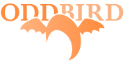

:title: Getting started testing
:author: Carl Meyer
:description: a presentation on getting started testing, for PyCon US 2013
:keywords: presentation, python, testing, pycon

:skip-help: true

----

:id: title

Getting started testing
=======================

|hcard|

----

:id: thistalk
:data-reveal: 1

This talk
---------

* Why test?

* How to test?

* When to test?

* How much to test?

* What if...?

|lightbulb|

.. |lightbulb| raw:: html

   

.. note::

   So here's the plan for the next half hour:

   * We'll discuss (briefly!) why to write tests.

   * We'll talk about how to write tests in Python, with lots of code examples
     and tool recommendations.

   * We'll talk about when to write your tests,

   * ...which tests and how many tests to write.

   * And we'll talk about some common what-if scenarios, like adding tests to a
     large untested codebase.

   Hopefully by the end the testing lightbulb will turn on (if it hasn't
   already), and you'll be so hooked you won't even be able to sleep tonight
   until you've written a bunch of tests.

----

:data-reveal: 1

Me
----

* Writing Python since 2002.

* Professionally since 2007.

* Writing a lot of tests since 2009.

* Mostly web development.

.. note::

   A very brief story about me, Python, and testing...

   I like to write tests. Even this slide deck has tests!

   I mostly do web development, but I've tried to keep this talk general.

----

.. note::

   I work at OddBird, we build beautiful web apps, you can hire us!

----

Let's make a thing!
-------------------

.. note::

   A GitHub recommendation engine!

   Find the projects you ought to know about, but don't yet, based on the
   projects other people are watching who tend to watch the same projects you
   do.

   (It's been done already. Oh well.)

----

.. code:: python

    def similarity(watched1, watched2):
        """
        Similarity score between users.

        Users represented as list of watched repos.

        Score is Jaccard index (intersection / union).

        """
        intersection = watched1.intersection(watched2)
        union = watched1.union(watched2)

        return float(len(intersection)) / len(union)

----

.. code:: python

    def similarity(watched1, watched2):
        """
        Return similarity score between users watching given sets of repos.

        The similarity score is the Jaccard index (size of intersection / size of
        union); it varies between 0 (no similarity) and 1 (identical sets).

        """
        intersection = watched1.intersection(watched2)
        union = watched1.union(watched2)

        return float(len(intersection)) / len(union)

----

.. code:: python

    >>> similarity({'a', 'b'}, {'b', 'c'})
    0.3333333333333333

    >>> similarity({'a', 'b', 'c'}, {'b', 'c', 'd'})
    0.5

    >>> similarity({'a', 'b', 'c'}, {'d'})
    0.0

    >>> similarity(set(), set())
    Traceback (most recent call last):
      File "<stdin>", line 1, in <module>
      File "./ghre/similarity.py", line 12, in similarity_score
        return float(len(intersection)) / len(union)
    ZeroDivisionError: float division by zero

----

:id: questions

Questions?
==========

* `oddbird.github.com/start-testing`_
* `pytest.org`_
* `nedbatchelder.com/code/coverage/`_
* `www.voidspace.org.uk/python/mock/`_
* `tox.readthedocs.org`_
* `webtest.pythonpaste.org`_

.. _oddbird.github.com/start-testing: http://oddbird.github.com/start-testing
.. _pytest.org: http://pytest.org/
.. _nedbatchelder.com/code/coverage/: http://nedbatchelder.com/code/coverage/
.. _www.voidspace.org.uk/python/mock/: http://www.voidspace.org.uk/python/mock/
.. _tox.readthedocs.org: http://tox.readthedocs.org
.. _webtest.pythonpaste.org: http://webtest.pythonpaste.org

|hcard|

.. |hcard| raw:: html

  

  
  <h2 class="fn">Carl Meyer</h2>
  <ul class="links">
    <li><a href="http://www.oddbird.net" class="org url">oddbird.net</a></li>
    <li><a href="https://twitter.com/carljm" rel="me">@carljm</a></li>
  </ul>
  

